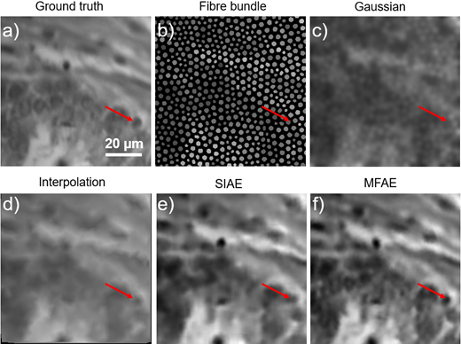
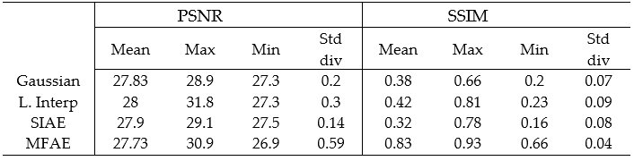

<h1 align="center"> Fibre bundle image reconstruction using convolutional neural networks and bundle rotation in endomicroscopy </h1>

Fibre-bundle endomicroscopy suffers from imaging problems mainly the honey-comb effect. Fibre bundle are made from many individual fibres, up to 30,000, that are surounded by cladding to stop light from transfering between each of the fibres. It is this cladding the all so stop light from the sample reaching the imaging camera, this is known as the honeycomb effect for it's disticnt pattern.

Different methods have been used to attempt to remedy this effect such as Gaussian blurring, linear interpolat and most recently super resolution. Multi frame super resolution (MFSR) has been thought of the next step in certain super resolution pracices. With the introduction of using multiple images with high temperal resolution they can be combined to form a single high resolution (HR) image.

Multi image super resolution is a promising approach to improving the reconstruction of fibre bundle images. Endomicroscopy already oversamples areas of tissue thereby generating many images of the same sample with minor changes in alignment. In this project we synthetically generate fibre-bundle images and rotate a fibe mask to recreate the effect of rotating the fibre on a sample area to oversample the tissue. Using these images a multiframe super resolution model was designed to reconstuct the ground truth image. We were able to improve the structural similarity index measurement (SSIM) of the image by 1.48 fold compared to linear interpolation.

The dataset used in this project was aquired using a custom build setup of a slide provided by Wael Ageeli.

# 1.0 Getting started:
## Requirements
- Python 3.9 
- Tensorflow 2.6
- Numpy 1.21.2
- Matplotlib 3.5.1
- opencv-python 4.5.5.62
- scikit-image 0.19.1
- tqdm 4.62.3
- scipy 1.7.1

This code was tested using Microsoft visual studio 2019 version 16.11.3

## Order of execution
1. Preprocessing_Dataset.py
2. Train_MFAE.py 
3. Test_MFAE.py

Each file is described in detail below.
 
 
# 2.0 Python script notes
This project is broken down into three scrips. The frist proccesses the original images and outputs the stacked training, validation and testing datasets to be used by the model in training and testing. The other two contain the code to train and test the MF-UNet model respectively. Each code is broek down into sections below.

## 2.1 Preprocessing_Dataset.py
The preprocessing python script is split into three sections. 
- The first divides the original images into 256x256 slices that will be used as the HR ground truth. 
- The slices are then Overlayed with the selected binary fibre bundle mask, the mask is rotated from -10 degrees to +10 degrees, a user defined number of times, synthetically replicating the fibre-bundle rotation method. Each set of LR images are added into an array of N,256,256,C where N is the number of slices and C in the number of channels (rotations). 
- The final section saves the arrays into an output folder as ".npy" so they can be read in easier.

## 2.2 Train_MFAE.py
To train the model the script is again split into three sections for easier use. 
- The first section loads the preprocessing training output datasets into their respective variables. The datasets are then split into an 80/20 for training and validation respectively.
- The model is then loaded along with the optimiser and loss functions required for training the model using the dataset.
- Finally the model is compiled with the optimiser and loss funtion, then trained using the dataset. Once the training is complete the model is saved into a specified folder. This will be used to load the model for testing.

## 2.3 Test_MFAE.py
Finally the testing script.
- The first section, loads the LR and HR testing datasets created by the preprocessing script along with the trained model created by the previous script. Note: The HR images are only loaded for displaying a comparison of SR images.
- Each of the images in the testing dataset are then input into the model and a predicted output image is returned which is then saved into a separate folder.
- The middle section of this code is only used for testing purposes. The code will only input one image into the model and display a figure containing the ground truth, low resolution and super resolution image. None of these images are saved.

# 3.0 Results
The resulting images were compared to gaussian blurring, linear interpolation, single image super resolution, and our MFAE (Fig 1.). Red arrows have been added to each reconstruction to draw attention to a small element that improves in detail with each method. Table 1 shows the numerical analysis results performed on each method compared to the ground truth image. 

It can be seen from table 1 that the SSIM has more than doubled when using MFAE compared to Gaussian blurring. This gives a promising result as many sources have cited SSIM as being useful for image analysis.

<figcaption>Fig 1. reconstruction method comparison on acquired prostate images. (a) ground truth. (b) averaged fibre bundle. (c) gaussian blurring. (d) linear interpolation. (e)single image auto encoder. (f) multi-frame autoencoder. </figcaption>

<figcaption>Table 1. Image quality assessment. </figcaption>

